# Diagrama de Classes - AgilizaPSI

## Diagrama em Mermaid

```mermaid
classDiagram
    class User {
        +String id
        +String name
        +String email
        +String phone
        +UserRole role
        +String password
        +String? crp
        +String? specialization
        +String? bio
        +Int? experience
        +String[] languages
        +String[] specialties
        +String? accessToken
        +String? clinicId
        +DateTime createdAt
        +DateTime updatedAt
        +createAppointment()
        +updateProfile()
        +sendMessage()
    }

    class Clinic {
        +String id
        +String name
        +String? email
        +String? phone
        +String? address
        +String? cnpj
        +String? description
        +String? accessToken
        +String[] workingDays
        +String workingHoursStart
        +String workingHoursEnd
        +Int minAdvanceBookingDays
        +Int maxAdvanceBookingDays
        +Boolean isActive
        +DateTime createdAt
        +DateTime updatedAt
        +addProfessional()
        +updateSettings()
    }

    class ClinicSettings {
        +String id
        +String clinicName
        +String? clinicEmail
        +String? clinicPhone
        +String? clinicAddress
        +String? clinicCNPJ
        +String[] workingDays
        +String workingHoursStart
        +String workingHoursEnd
        +Int appointmentDuration
        +Boolean enableEmailReminders
        +Boolean enableSMSReminders
        +String? platformPixKey
        +DateTime createdAt
        +DateTime updatedAt
    }

    class Appointment {
        +String id
        +String psychologistId
        +String? patientId
        +DateTime date
        +String startTime
        +String endTime
        +Int duration
        +AppointmentStatus status
        +AppointmentType type
        +String? notes
        +Float? price
        +String? meetingLink
        +Boolean reminderSent
        +DateTime createdAt
        +DateTime updatedAt
        +confirm()
        +cancel()
        +reschedule()
    }

    class MedicalRecord {
        +String id
        +String appointmentId
        +String patientId
        +String psychologistId
        +String chiefComplaint
        +String? diagnosis
        +String? treatment
        +String? observations
        +String? evolution
        +String? prescription
        +PsychiatricFollowUp? psychiatricFollowUp
        +DateTime createdAt
        +DateTime updatedAt
        +updateRecord()
        +attachDocument()
    }

    class Payment {
        +String id
        +String appointmentId
        +Float amount
        +PaymentStatus status
        +PaymentMethod? method
        +String? transactionId
        +DateTime? paidAt
        +DateTime createdAt
        +DateTime updatedAt
        +processPayment()
        +refund()
    }

    class Withdrawal {
        +String id
        +String psychologistId
        +Float amount
        +WithdrawalStatus status
        +String? method
        +String? bankAccountId
        +String? notes
        +DateTime? processedAt
        +DateTime createdAt
        +DateTime updatedAt
        +process()
        +cancel()
    }

    class Reminder {
        +String id
        +String appointmentId
        +String userId
        +ReminderType type
        +DateTime scheduledFor
        +Boolean sent
        +DateTime? sentAt
        +String message
        +DateTime createdAt
        +DateTime updatedAt
        +send()
        +markAsSent()
    }

    class ChatMessage {
        +String id
        +String senderId
        +String receiverId
        +String message
        +Boolean read
        +DateTime? readAt
        +DateTime createdAt
        +DateTime updatedAt
        +markAsRead()
        +delete()
    }

    class PsychologistSettings {
        +String id
        +String psychologistId
        +String workingHoursStart
        +String workingHoursEnd
        +Int defaultSessionDuration
        +Float defaultPrice
        +Boolean acceptOnlineAppointments
        +Boolean acceptInPersonAppointments
        +Boolean autoConfirmAppointments
        +Boolean enableCheckout
        +String? pixKey
        +String? bio
        +String[] specialties
        +String[] languages
        +DateTime createdAt
        +DateTime updatedAt
        +updateSettings()
    }

    class Availability {
        +String id
        +String psychologistId
        +DateTime date
        +String[] availableSlots
        +Boolean isAvailable
        +DateTime createdAt
        +DateTime updatedAt
        +addSlot()
        +removeSlot()
    }

    class BankAccount {
        +String id
        +String userId
        +String? paymentMethod
        +String? bankName
        +String? agency
        +String? account
        +String? accountType
        +String? pixKey
        +String? pixKeyType
        +String? accountHolderName
        +String? cpf
        +DateTime createdAt
        +DateTime updatedAt
        +updateAccount()
    }

    class Account {
        +String id
        +String userId
        +String type
        +String provider
        +String providerAccountId
        +String? refresh_token
        +String? access_token
        +DateTime createdAt
        +DateTime updatedAt
    }

    class Session {
        +String id
        +String sessionToken
        +String userId
        +DateTime expires
        +DateTime createdAt
        +DateTime updatedAt
    }

    %% Relacionamentos
    User "1" --> "*" Clinic : pertence a
    Clinic "1" --> "1" ClinicSettings : possui
    User "1" --> "*" Appointment : agenda como psicólogo
    User "1" --> "*" Appointment : agenda como paciente
    Appointment "1" --> "1" MedicalRecord : gera
    Appointment "1" --> "0..1" Payment : possui
    User "1" --> "1" PsychologistSettings : possui
    User "1" --> "*" Availability : possui
    User "1" --> "0..1" BankAccount : possui
    User "1" --> "*" Withdrawal : solicita
    BankAccount "1" --> "*" Withdrawal : usado em
    Appointment "1" --> "*" Reminder : gera
    User "1" --> "*" Reminder : recebe
    User "1" --> "*" ChatMessage : envia
    User "1" --> "*" ChatMessage : recebe
    User "1" --> "*" Account : possui
    User "1" --> "*" Session : possui
    MedicalRecord "1" --> "1" User : paciente
    MedicalRecord "1" --> "1" User : psicólogo
```

---

## Diagrama em PlantUML

```plantuml
@startuml DiagramaClasses_AgilizaPSI

package "Autenticação" {
    class Account {
        +String id
        +String userId
        +String type
        +String provider
        +String providerAccountId
        +String? refresh_token
        +String? access_token
    }

    class Session {
        +String id
        +String sessionToken
        +String userId
        +DateTime expires
    }
}

package "Usuários e Clínicas" {
    class User {
        +String id
        +String name
        +String email
        +String phone
        +UserRole role
        +String password
        +String? crp
        +String? specialization
        +String? bio
        +Int? experience
        +String[] languages
        +String[] specialties
        +String? accessToken
        +String? clinicId
        +DateTime createdAt
        +DateTime updatedAt
    }

    class Clinic {
        +String id
        +String name
        +String? email
        +String? phone
        +String? address
        +String? cnpj
        +String? description
        +String? accessToken
        +String[] workingDays
        +String workingHoursStart
        +String workingHoursEnd
        +Int minAdvanceBookingDays
        +Int maxAdvanceBookingDays
        +Boolean isActive
        +DateTime createdAt
        +DateTime updatedAt
    }

    class ClinicSettings {
        +String id
        +String clinicName
        +String? clinicEmail
        +String? clinicPhone
        +String? clinicAddress
        +String? clinicCNPJ
        +String[] workingDays
        +String workingHoursStart
        +String workingHoursEnd
        +Int appointmentDuration
        +Boolean enableEmailReminders
        +Boolean enableSMSReminders
        +String? platformPixKey
        +DateTime createdAt
        +DateTime updatedAt
    }

    class PsychologistSettings {
        +String id
        +String psychologistId
        +String workingHoursStart
        +String workingHoursEnd
        +Int defaultSessionDuration
        +Float defaultPrice
        +Boolean acceptOnlineAppointments
        +Boolean acceptInPersonAppointments
        +Boolean autoConfirmAppointments
        +Boolean enableCheckout
        +String? pixKey
        +String? bio
        +String[] specialties
        +String[] languages
        +DateTime createdAt
        +DateTime updatedAt
    }

    class Availability {
        +String id
        +String psychologistId
        +DateTime date
        +String[] availableSlots
        +Boolean isAvailable
        +DateTime createdAt
        +DateTime updatedAt
    }
}

package "Agendamentos" {
    class Appointment {
        +String id
        +String psychologistId
        +String? patientId
        +DateTime date
        +String startTime
        +String endTime
        +Int duration
        +AppointmentStatus status
        +AppointmentType type
        +String? notes
        +Float? price
        +String? meetingLink
        +Boolean reminderSent
        +DateTime createdAt
        +DateTime updatedAt
    }

    class Reminder {
        +String id
        +String appointmentId
        +String userId
        +ReminderType type
        +DateTime scheduledFor
        +Boolean sent
        +DateTime? sentAt
        +String message
        +DateTime createdAt
        +DateTime updatedAt
    }
}

package "Prontuários" {
    class MedicalRecord {
        +String id
        +String appointmentId
        +String patientId
        +String psychologistId
        +String chiefComplaint
        +String? diagnosis
        +String? treatment
        +String? observations
        +String? evolution
        +String? prescription
        +PsychiatricFollowUp? psychiatricFollowUp
        +DateTime createdAt
        +DateTime updatedAt
    }
}

package "Pagamentos" {
    class Payment {
        +String id
        +String appointmentId
        +Float amount
        +PaymentStatus status
        +PaymentMethod? method
        +String? transactionId
        +DateTime? paidAt
        +DateTime createdAt
        +DateTime updatedAt
    }

    class BankAccount {
        +String id
        +String userId
        +String? paymentMethod
        +String? bankName
        +String? agency
        +String? account
        +String? accountType
        +String? pixKey
        +String? pixKeyType
        +String? accountHolderName
        +String? cpf
        +DateTime createdAt
        +DateTime updatedAt
    }

    class Withdrawal {
        +String id
        +String psychologistId
        +Float amount
        +WithdrawalStatus status
        +String? method
        +String? bankAccountId
        +String? notes
        +DateTime? processedAt
        +DateTime createdAt
        +DateTime updatedAt
    }
}

package "Comunicação" {
    class ChatMessage {
        +String id
        +String senderId
        +String receiverId
        +String message
        +Boolean read
        +DateTime? readAt
        +DateTime createdAt
        +DateTime updatedAt
    }
}

' Relacionamentos - Autenticação
User "1" --> "*" Account
User "1" --> "*" Session

' Relacionamentos - Clínicas
User "1" --> "0..1" Clinic : pertence a
Clinic "1" --> "*" User : profissionais
Clinic "1" --> "0..1" ClinicSettings

' Relacionamentos - Configurações
User "1" --> "0..1" PsychologistSettings
User "1" --> "*" Availability

' Relacionamentos - Agendamentos
User "1" --> "*" Appointment : como psicólogo
User "1" --> "*" Appointment : como paciente
Appointment "1" --> "*" Reminder
User "1" --> "*" Reminder

' Relacionamentos - Prontuários
Appointment "1" --> "0..1" MedicalRecord
User "1" --> "*" MedicalRecord : como paciente
User "1" --> "*" MedicalRecord : como psicólogo

' Relacionamentos - Pagamentos
Appointment "1" --> "0..1" Payment
User "1" --> "0..1" BankAccount
User "1" --> "*" Withdrawal
BankAccount "1" --> "*" Withdrawal

' Relacionamentos - Comunicação
User "1" --> "*" ChatMessage : envia
User "1" --> "*" ChatMessage : recebe

@enduml
```

---

## Enumeradores (Enums)

### UserRole
- `USER` - Paciente
- `ADMIN` - Administrador
- `PSICOLOGO` - Psicólogo

### AppointmentStatus
- `PENDING` - Pendente
- `CONFIRMED` - Confirmado
- `CANCELLED` - Cancelado
- `COMPLETED` - Concluído

### AppointmentType
- `ONLINE` - Online
- `PRESENCIAL` - Presencial

### PaymentStatus
- `PENDING` - Pendente
- `PAID` - Pago
- `CANCELLED` - Cancelado
- `REFUNDED` - Reembolsado

### PaymentMethod
- `PIX`
- `CREDIT_CARD` - Cartão de Crédito
- `DEBIT_CARD` - Cartão de Débito
- `BANK_TRANSFER` - Transferência Bancária
- `CASH` - Dinheiro

### WithdrawalStatus
- `PENDING` - Pendente
- `PROCESSING` - Processando
- `COMPLETED` - Concluído
- `CANCELLED` - Cancelado
- `REJECTED` - Rejeitado

### ReminderType
- `EMAIL`
- `SMS`
- `WHATSAPP`

### PsychiatricFollowUp
- `NAO` - Não
- `SIM` - Sim
- `JA_FEZ` - Já fez

---

## Descrição dos Relacionamentos

### 1. User ↔ Clinic
- **Tipo:** Associação (Many-to-One)
- **Descrição:** Um usuário (psicólogo) pertence a uma clínica. Uma clínica possui vários profissionais.
- **Cardinalidade:** User (N) → Clinic (1)

### 2. Clinic ↔ ClinicSettings
- **Tipo:** Composição (One-to-One)
- **Descrição:** Uma clínica possui configurações específicas.
- **Cardinalidade:** Clinic (1) → ClinicSettings (1)

### 3. User ↔ Appointment
- **Tipo:** Associação (One-to-Many)
- **Descrição:** Um usuário pode ter múltiplos agendamentos como psicólogo ou como paciente.
- **Cardinalidade:** User (1) → Appointment (N)

### 4. Appointment ↔ MedicalRecord
- **Tipo:** Associação (One-to-One)
- **Descrição:** Um agendamento pode gerar um prontuário eletrônico.
- **Cardinalidade:** Appointment (1) → MedicalRecord (0..1)

### 5. Appointment ↔ Payment
- **Tipo:** Associação (One-to-One)
- **Descrição:** Um agendamento pode ter um pagamento associado.
- **Cardinalidade:** Appointment (1) → Payment (0..1)

### 6. User ↔ PsychologistSettings
- **Tipo:** Associação (One-to-One)
- **Descrição:** Um psicólogo possui configurações específicas.
- **Cardinalidade:** User (1) → PsychologistSettings (0..1)

### 7. User ↔ Availability
- **Tipo:** Associação (One-to-Many)
- **Descrição:** Um psicólogo possui múltiplas disponibilidades.
- **Cardinalidade:** User (1) → Availability (N)

### 8. User ↔ BankAccount
- **Tipo:** Associação (One-to-One)
- **Descrição:** Um usuário pode ter uma conta bancária cadastrada.
- **Cardinalidade:** User (1) → BankAccount (0..1)

### 9. User ↔ Withdrawal
- **Tipo:** Associação (One-to-Many)
- **Descrição:** Um psicólogo pode solicitar múltiplos saques.
- **Cardinalidade:** User (1) → Withdrawal (N)

### 10. Appointment ↔ Reminder
- **Tipo:** Associação (One-to-Many)
- **Descrição:** Um agendamento pode gerar múltiplos lembretes.
- **Cardinalidade:** Appointment (1) → Reminder (N)

### 11. User ↔ ChatMessage
- **Tipo:** Associação (One-to-Many)
- **Descrição:** Um usuário pode enviar e receber múltiplas mensagens.
- **Cardinalidade:** User (1) → ChatMessage (N) [enviadas]
- **Cardinalidade:** User (1) → ChatMessage (N) [recebidas]

### 12. User ↔ Account / Session
- **Tipo:** Associação (One-to-Many)
- **Descrição:** Um usuário pode ter múltiplas contas de autenticação e sessões ativas.
- **Cardinalidade:** User (1) → Account (N)
- **Cardinalidade:** User (1) → Session (N)

---

## Observações Importantes

1. **Isolamento por Clínica:** Todos os dados (agendamentos, pacientes, mensagens, prontuários, pagamentos) são filtrados pela `clinicId` do profissional, garantindo que cada clínica opere de forma isolada.

2. **Multi-tenancy:** O sistema suporta múltiplas clínicas, cada uma com seus próprios profissionais, pacientes e dados.

3. **Roles e Permissões:** O sistema diferencia três tipos de usuários:
   - **ADMIN:** Acesso total ao sistema
   - **PSICOLOGO:** Acesso ao dashboard profissional da sua clínica
   - **USER:** Acesso ao agendamento e comunicação com psicólogos

4. **Integridade Referencial:** Relacionamentos importantes usam `onDelete: Cascade` para manter a integridade dos dados.

5. **Auditoria:** Todas as entidades principais possuem `createdAt` e `updatedAt` para rastreamento de alterações.

---

**Data de Criação:** 2025  
**Versão do Documento:** 1.0  
**Última Atualização:** 2025

